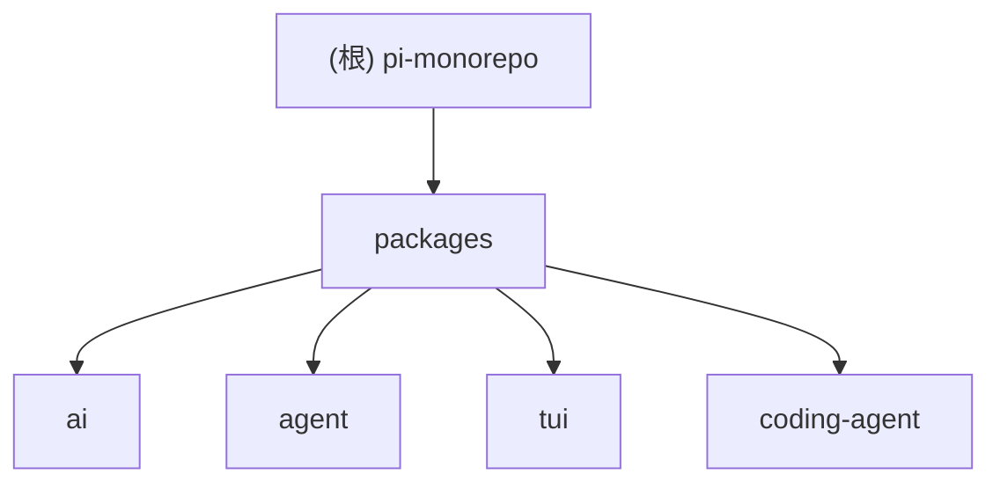

# Pi Agent Harness Mono Repo

## 变更记录 (Changelog)

- 2026-06-23T10:28:45+08:00：初始化项目扫描文档；生成根级架构摘要、模块结构图、模块索引、运行/测试/规范与 AI 使用指引。

## 项目愿景

Pi 是一个面向终端与可嵌入场景的 agent harness monorepo，目标是提供统一 LLM Provider 接入、通用 Agent Runtime、差分渲染 TUI，以及可扩展的交互式 Coding Agent CLI。项目强调最小内核、TypeScript 扩展机制、可复现依赖与供应链硬化。

## 架构总览

仓库采用 npm workspaces 与 TypeScript ESM 组织，根包负责统一脚本、依赖约束、版本发布与质量门禁。核心调用链大致为：`pi-coding-agent` 作为 CLI/SDK 入口，组合 `pi-agent-core` 的 agent loop 与 session harness，通过 `pi-ai` 访问多 Provider 模型，并用 `pi-tui` 构建交互式终端界面。

主要层次：

- `packages/ai`：统一多 Provider LLM API、模型注册、流式事件、OAuth、图片生成与跨 Provider handoff。
- `packages/agent`：通用 Agent、Agent loop、工具调用、事件流、harness、session、compaction、skills 与 prompt templates。
- `packages/tui`：终端 UI 基础设施、组件、键盘输入、差分渲染、overlay、图片渲染与宽度计算。
- `packages/coding-agent`：最终用户 CLI、交互/print/json/rpc/sdk 模式、内置工具、配置、扩展、主题、session 管理与发布资产。

## 模块结构图（Mermaid）

## 模块索引

| 模块 | 包名 | 职责 | 入口猜测 | 测试目录 | 配置 |
| --- | --- | --- | --- | --- | --- |
| `packages/ai` | `@earendil-works/pi-ai` | 统一多 Provider LLM API 与模型/图片/认证能力 | `src/index.ts`, `src/cli.ts` | `test/` | `package.json`, `tsconfig.build.json` |
| `packages/agent` | `@earendil-works/pi-agent-core` | Agent Runtime、loop、harness、session 与 compaction | `src/index.ts`, `src/agent.ts`, `src/agent-loop.ts` | `test/` | `package.json`, `vitest.config.ts`, `vitest.harness.config.ts`, `tsconfig.build.json` |
| `packages/tui` | `@earendil-works/pi-tui` | 差分渲染终端 UI 框架与组件库 | `src/index.ts`, `src/tui.ts` | `test/` | `package.json`, `vitest.config.ts`, `tsconfig.build.json` |
| `packages/coding-agent` | `@earendil-works/pi-coding-agent` | 交互式 Coding Agent CLI、SDK、工具、扩展与模式 | `src/cli.ts`, `src/main.ts`, `src/index.ts` | `test/` | `package.json`, `tsconfig.build.json`, `tsconfig.examples.json` |

## 运行与开发

- 安装依赖：`npm install --ignore-scripts`。
- 构建全部包：`npm run build`。
- 质量检查：`npm run check`，包含 Biome、依赖 pin 检查、TypeScript import 检查、shrinkwrap 检查、`tsgo --noEmit` 与 browser smoke。
- 测试：根级通用测试优先使用 `./test.sh`；不要直接运行完整 vitest suite，除非明确需要。
- 本地启动源码 CLI：`./pi-test.sh`。

## 测试策略

项目以包级测试为主：`packages/ai` 和 `packages/agent` 使用 Vitest；`packages/tui` 使用 Node test 与包内测试文件；`packages/coding-agent` 使用大量 Vitest 单元/集成/回归测试，并在 `test/suite/` 中维护基于 faux provider 的 agent-session 测试。LLM 相关 e2e 或需要真实凭据的测试不应在常规扫描/修改中默认触发。

## 编码规范

- TypeScript 源码使用 ESM 与显式 `.ts` 扩展导入风格。
- 根配置覆盖的源码只能使用 Node strip-only 可擦除 TypeScript 语法，避免 enum、namespace、parameter properties 等需要 JS emit 的语法。
- 不使用 `any`，除非确有必要。
- 不使用动态 inline import；外部 API 类型需查实际依赖类型，不猜测。
- 依赖变更视为代码变更，直接外部依赖保持 exact pin。
- `packages/ai/src/models.generated.ts` 不直接手改；更新生成脚本后再重新生成。

## AI 使用指引

- 优先读取 `AGENTS.md` 与相关模块 `CLAUDE.md`，再处理代码任务。
- 多 agent/session 并行工作时只触碰本次任务明确相关文件，避免 `git add -A`、`git reset --hard`、`git clean -fd` 等破坏性操作。
- 文档任务只更新文档与索引，不修改源码、不 bump 版本、不运行构建。
- 代码修改后按项目规则运行 `npm run check`；测试文件变更后运行对应测试。
- 提交仅在用户明确要求时执行，且只 stage 本会话修改的显式路径。

## 扫描覆盖率与缺口

本次扫描以轻量清点和模块优先扫描为主，读取了根 README、根 package、`.gitignore`、`AGENTS.md`、四个 package.json、代表性 README、模块导出入口与 CLI 入口。未深读所有源码、测试、docs、examples 与生成文件。

主要缺口：

- `packages/coding-agent/src/modes/**`、`src/core/tools/**`、`src/core/extensions/**` 仅做路径级识别，未完整分页读取。
- `packages/ai/src/providers/**` 与 OAuth/图片子系统未逐文件扫描。
- `packages/agent/src/harness/**` 与 session storage 细节未完整深读。
- `packages/tui/src/components/**` 与 terminal image/native 细节未完整深读。
- `docs/superpowers/**` 属于项目外层设计文档，未纳入 `pi` 模块级文档。
